
Prepared by: TAKI Oussama

<h1>Report on Inversion of Control and Dependency Injection</h1>
<h2 style="color: cadetblue">Introduction</h2>

Inversion of Control (IoC) is a concept that allows managing an object's dependencies without directly instantiating them. In the context of object creation, Spring intervenes to inject dependencies between different components (called Beans) to ensure that all required relationships are established.

This mechanism allows developers to focus more on the business logic of their application, while Spring handles dependency injection and offers various technical features.

<h2 style="color: cadetblue">Statement</h2>
<ol>
    <li>DAO Layer
        <ul>
            <li>Create the IDao interface</li>
            <li>Create an implementation of the IDao interface</li>
        </ul>
    </li>
    <li>Business Layer
        <ul>
            <li>Create the IMetier interface</li>
            <li>Create an implementation of the IMetier interface</li>
        </ul>
    </li>
    <li>Presentation Layer
        
Create an application that allows dependency injection

        <ul>
        <li>Static instantiation</li>
        <li>Dynamic instantiation</li>
        <li>Using Spring Framework
            <ul>
                <li>XML version</li>
                <li>Annotation version</li>
            </ul>
        </li>
        </ul>
    </li>
</ol>
<h2 style="color: cadetblue">Design</h2>
<h3>Principle of Loose Coupling</h3>
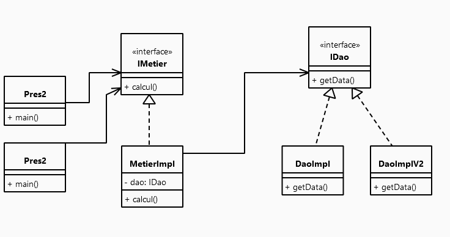

When aiming to achieve loose coupling, the use of interfaces is essential. To illustrate this, consider two classes: `DaoImpl`, which implements the `IDao` interface, and `MetierImpl`, which implements the `IMetier` interface.

When the `MetierImpl` class is associated with the `IDao` interface, it can be said that the `MetierImpl` class and the `IDaoImpl` class are loosely coupled.

This means that the `MetierImpl` class can collaborate with any class that adheres to the contract defined by the `IDao` interface. In reality, the `MetierImpl` class is only aware of the existence of this interface, which means it can be associated with any class that implements this interface without requiring modifications in the `MetierImpl` class.

Loose coupling thus allows creating applications that are resistant to internal changes while being flexible for extensions.

<h2 style="color: cadetblue">Screenshots</h2>
<h3>Creating the IDao Interface</h3>
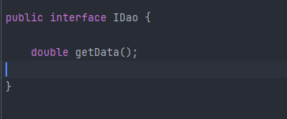
<h3>Creating an Implementation of the IDao Interface for Database</h3>
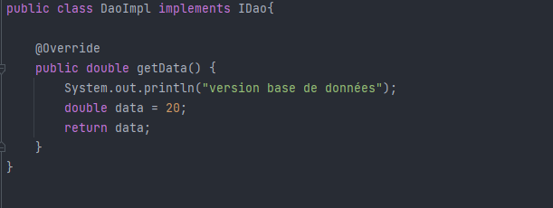
<h3>Creating an Implementation of the IDao Interface for Web Services</h3>
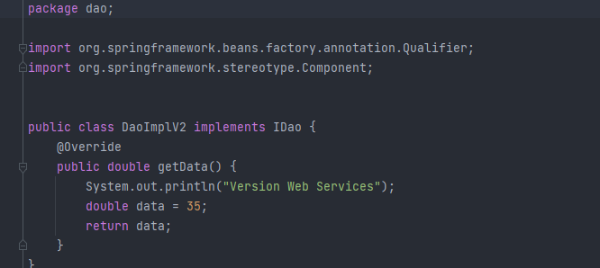

<h3>Creating the IMetier Interface</h3>
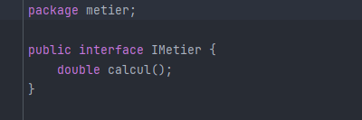
<h3>Creating an Implementation of the IMetier Interface</h3>
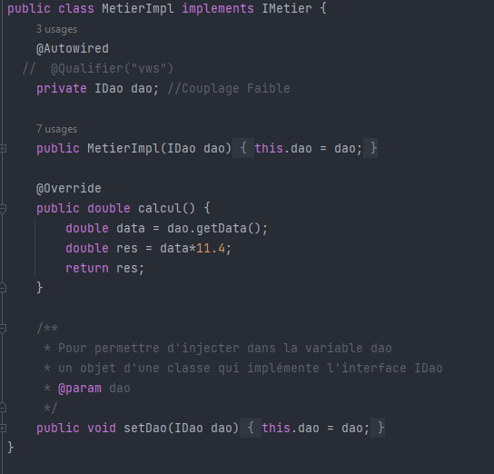
<h3>Static Instantiation</h3>
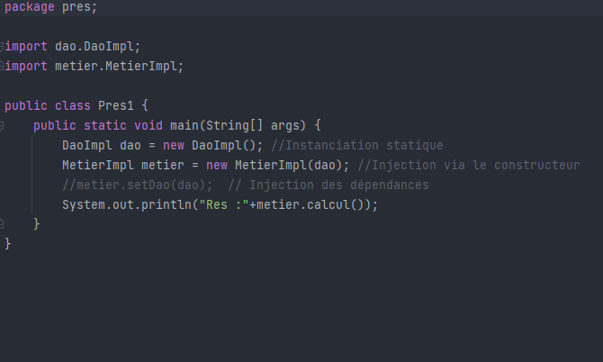
<h3>Dynamic Instantiation</h3>
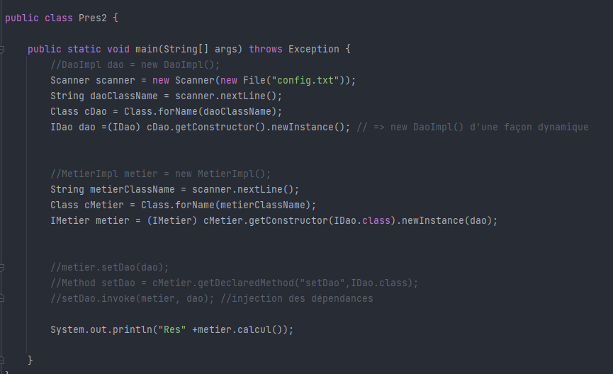
<h3>Dependency Injection Using Spring XML Version</h3>

First, install the dependencies, then add a config.xml file

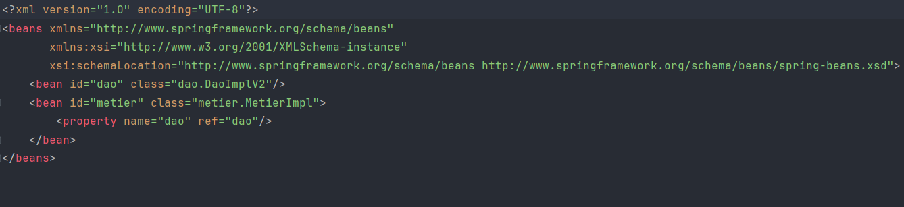
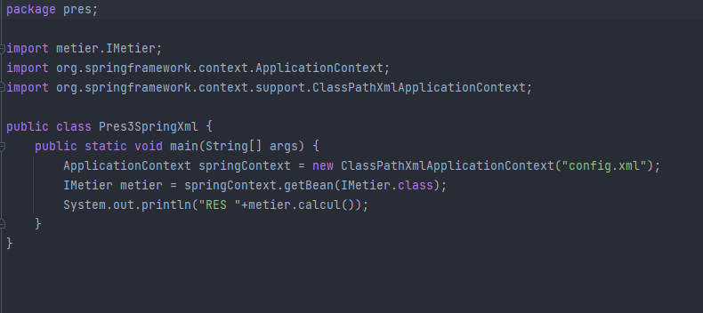
<h3>Dependency Injection Using Spring Annotations Version</h3>

Repository Class

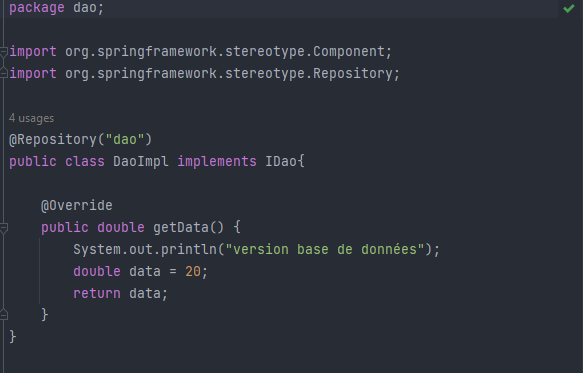

Service Class

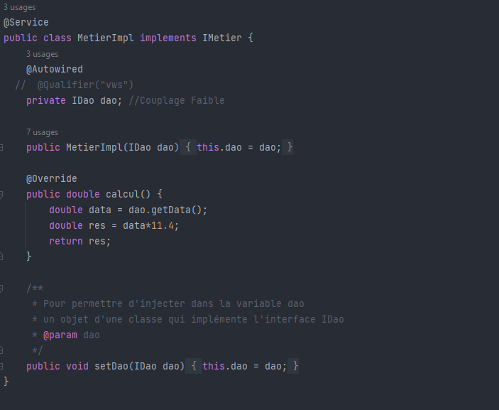

Controller

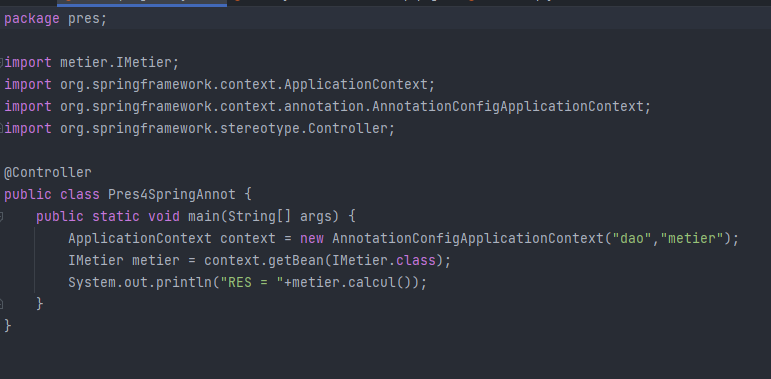